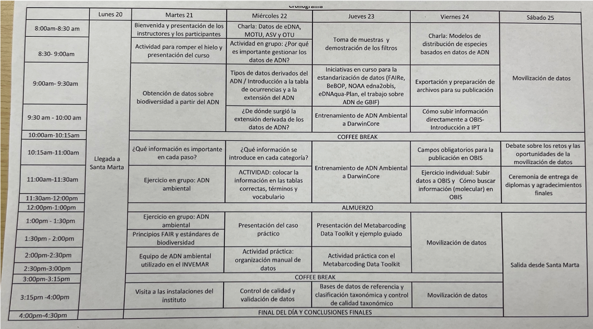

{width="6%"} {width="20%"}

## Course Schedule
{width="20%"}

*Click to enlarge*

## DNA Data Management Slide Decks

Pick a deck to open it as a full-screen presentation

1. [What is Environmental DNA](https://github.com/iobis/obis_edna_slides/blob/invemar-training/slides/pdf_slides/1-introduction-edna.pdf){target="_blank" rel="noopener noreferrer"}?
    - Introduction to eDNA methods and what we can do with it
2. [What information is important at each step of an eDNA workflow?](https://github.com/iobis/obis_edna_slides/blob/invemar-training/slides/pdf_slides/2-information-at-each-step-edna-workflow.pdf){target="_blank" rel="noopener noreferrer"}
    - Overview of the information that should be captured when managing DNA datasets
3. [FAIR Data & Biodiversity Standards](index-fair-data.qmd)
    - Background information on what FAIR data is and a brief overview of Darwin Core and Essential Ocean Variables
4. [Darwin Core and DNA-Derived Data](index-dna-extension.qmd)
    - Overview of DNA data types and how DNA data fits into Darwin Core
5. [eDNA Data Management History](https://youtu.be/zsH8KIis_yA){target="_blank" rel="noopener noreferrer"} (YouTube recording)
6. [Mapping molecular data to Darwin Core](index-map-edna-to-dwc.html) 
    - How to record the important data and metadata in Darwin Core and the DNA-derived extension
7. Quality Control
    - [eDNA Quality Control](https://github.com/iobis/obis_edna_slides/blob/invemar-training/slides/pdf_slides/3_edna_qc_molecular.pdf){target="_blank" rel="noopener noreferrer"}
        - Overview of quality control steps in an eDNA workflow
    - [Taxonomy Quality Control (tool demo)](https://www.youtube.com/watch?v=e7HBAFf5NFg&feature=youtu.be){target="_blank" rel="noopener noreferrer"} (YouTube recording)
    - [OBIS Quality Control](index-qc.qmd)
        - Overview of quality control checks you should do with any OBIS dataset, DNA or otherwise
8. [Applications of eDNA for biodiversity monitoring](https://github.com/iobis/obis_edna_slides/blob/invemar-training/slides/pdf_slides/1b_applications_edna.pdf){target="_blank" rel="noopener noreferrer"}
9. [Ongoing data standardisation intitiatives (OBON)](https://www.youtube.com/playlist?list=PLS6jqgZoUzto){target="_blank" rel="noopener noreferrer"} (YouTube recording)
10. Reference databases, taxonomic assignment and validation
11. [Publishing & IPT](index-publishing.qmd)
    - How to publish data using the Integrated Publishing Toolkit (IPT) software
12. [Accessing OBIS (DNA) Data](index-access.qmd)
    - How to access data from OBIS, including DNA data

## Interactive Sessions

- [Match methods to DwC](index-DNA-game-instructions.qmd)
    - [Solution](index-game-solutions.qmd)
- [Format a DNA dataset with R](https://iobis.github.io/edna-training-beginner-track/episodes/04-structuring-datasets.html){target="_blank" rel="noopener noreferrer"}
