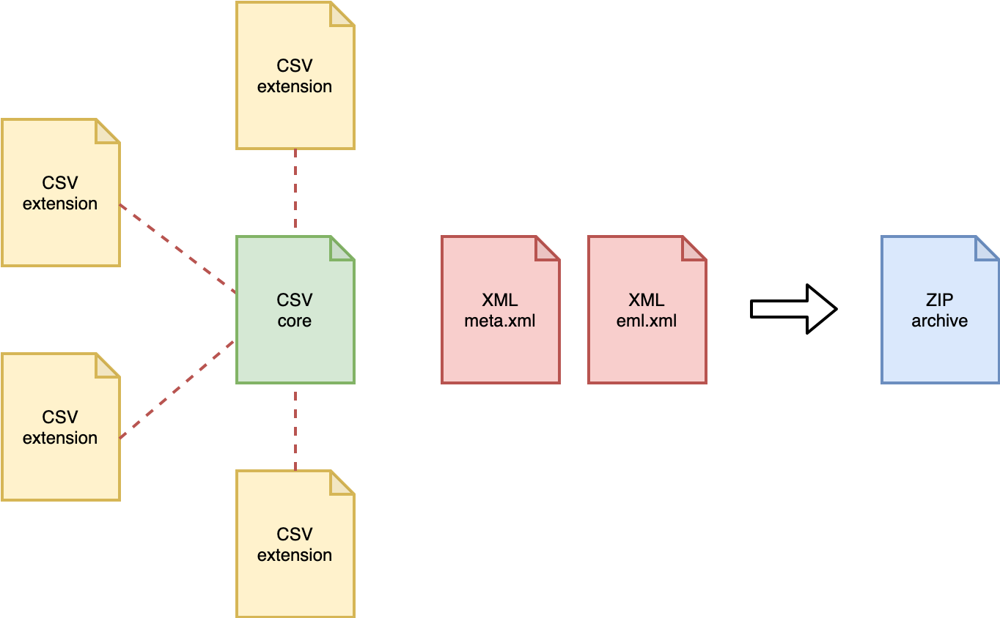
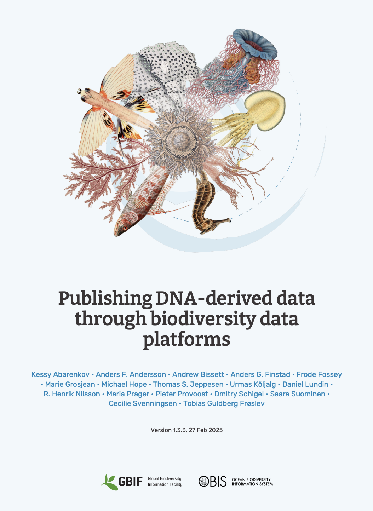

## What is OBIS?

:::: {.columns}

::: {.column width="60%"}
**Ocean Biodiversity Information System**

- Global open-access data system for marine life  
- UNESCO Intergovernmental Oceanographic Commission  
- >199 M occurrence records from >7,000 datasets  
- Data flows to GBIF — easy to publish once, reach both  

*Free to use. Free to contribute.*
:::

::: {.column width="40%"}


🌐 [obis.org](https://obis.org)  
📖 [manual.obis.org](https://manual.obis.org)
:::

::::

::: {.notes}
OBIS is endorsed by UNESCO's IOC. Data published there can flow to GBIF as well, giving you double visibility with a single submission. Emphasize that OBIS is not just a repository but actively feeds into global biodiversity assessments, climate analyses, and conservation planning.
:::


## A Mature Global Community

<link href="https://unpkg.com/maplibre-gl@3.1.0/dist/maplibre-gl.css" rel="stylesheet">
<script src="https://unpkg.com/maplibre-gl@3.1.0/dist/maplibre-gl.js"></script>
<script src="obis_nodes_map.js"></script>

<div id="nodesmap" style="position: absolute; top: 100px; left: 0; width: 100%; height: 80%; opacity: 0.25; z-index: 1;"></div>

<div style="position: relative; z-index: 10;">

OBIS is the world's largest **open-access repository**<br>for marine biodiversity data.

<br>
<br>

<div style="text-align: right;">
**36 nodes** 
<br>
across **99 countries**
<br>
representing **1,000+ institutions**
<br>
and **6,000+ scientists**.
</div>


</div>

<script>
setTimeout(() => initOBISMap('nodesmap', '#156082'), 300);
</script>

::: {.notes}
OBIS sits within UNESCO's IOC (IODE, est. 1961), working alongside ODIS for interoperability and OTGA for training.  Strong partnerships include GBIF, TDWG, EMODnet, GOOS, and DataONE.

Current stats: 136M species observations, 12M records from ABNJ, 28M DNA sequences (Jan 2026). 

This data supports multiple agreements: Paris Agreement, 30x30, GBF (Targets 3, 6, 8, 20, 21), SDG14, and now BBNJ.

Recognition: CBD COP16 recognized OBIS, GOOS, and ODIS as ocean components of the Global Biodiversity Observing System. 

OBIS is listed in KMGBF Targets 20 and 21. 

OBIS data supports: IPBES Global Assessment, UN World Ocean Assessments, UNESCO IOC Global HAB reports, State of the Ocean reports, TWAP Open Ocean component (UNEP), and CBD EBSA.
:::


## Why publish eDNA data?

<style>
.reveal table {
  font-size: 18px !important;
  width: 100%;
}
.reveal table th,
.reveal table td {
  padding: 15px !important;
}
</style>

:::: {.columns}
::: {.column width="55%"}
**eDNA captures what other methods miss**

- Cryptic and rare marine taxa  
- Non-invasive, scalable sampling  
- Community-level biodiversity signals  

**Shared eDNA data is powerful data**

- Data contributes to global analyses
- Data has long-term value 
- **Your sequences become findable** via OBIS sequence search tools

**The gap is real but rectifiable**

- Currently **fewer than 150** eDNA datasets in OBIS with standardized DNA extension  
:::

::: {.column width="45%" style="display:flex; align-items:center;"}
| Benefit | Why it matters |
|---|---|
| Open DOI | Citable in publications |
| Long-term archive | FAIR data |
| Global reach | OBIS + GBIF |
| Sequence search | Reuse & reanalysis |
:::

::::

::: {.notes}
Mention the OBIS sequence search prototype at sequence.obis.org — users can search for similar sequences across all OBIS datasets. This is only possible because sequences are published in standardized form.
:::


## The data standard

### Darwin Core + DNA Derived Data Extension



```
Darwin Core Archive (.zip)
├── meta.xml          ← links all tables
├── eml.xml           ← metadata (who, what, where, when, how)
├── occurrence.csv    ← the occurrence records
└── dna_derived.csv   ← the DNA extension (new!)
```

- **Darwin Core**: shared vocabulary for biodiversity data  
- **DNA Extension**: adds MIxS terms for sequences, primers, methods  
- Developed jointly by GBIF, OBIS, and the genomics community  
- Published guide: *[Publishing DNA-derived data through biodiversity data platforms](https://doi.org/10.35035/DOC-VF1A-NR22)*

::: {.notes}
MIxS = Minimum Information about any (x) Sequence. The extension incorporates these community standards so the same fields used in INSDC/GenBank submissions can be reused here.
:::

## The DNA publishing guide
{fig-align="center" width="90%"}

## Five data categories

Which one fits your data?

| # | Category | Example |
|---|---|---|
| **1** | **DNA-derived occurrences** | Metabarcoding (ASVs/OTUs assigned to taxa) |
| 2 | Enriched occurrences | Voucher specimen + barcoded |
| **3** | **Targeted species detection** | qPCR / ddPCR assays |
| 4 | Name references | Sequence in GenBank only |
| 5 | Metadata only | Dataset without sequences |

🔎 Use the [GBIF decision tree](https://docs.gbif.org/publishing-dna-derived-data/1.0/en/#data-packaging-and-mapping) to confirm your category

::: {.notes}
Categories 1 and 3 are by far the most common for eDNA researchers. Category 1 covers metabarcoding; Category 3 covers targeted detection methods like qPCR/ddPCR where no sequences are produced.
:::

---

## From raw outputs → long format

**Your typical metabarcoding outputs:**

| File | Content |
|---|---|
| OTU/ASV table | Sequences × Samples (read counts) |
| Taxonomy table | Sequence → taxon assignment |
| Sample metadata | Location, date, method |
| FASTA file | Actual DNA sequences |

**The transformation:**

> One row = one unique sequence **in** one sample = one occurrence record

```
seq_id  | sample_id | reads | taxon         | lat   | lon
asv001  | SMP_A01   | 342   | Calanus spp.  | 60.1  | 5.3
asv001  | SMP_A02   | 87    | Calanus spp.  | 60.2  | 5.4
asv002  | SMP_A01   | 12    | Unassigned    | 60.1  | 5.3
```

::: {.notes}
The most common stumbling block is this "wide to long" transformation. The OBIS manual has a clear diagram. The Metabarcoding Data Toolkit (MDT) can automate this for common pipeline outputs.
:::

---

## Table structure options

### Option A — Occurrence Core (simpler)

```
occurrence.csv  ←→  dna_derived.csv
(linked via occurrenceID)
```

### Option B — Event Core (recommended for eDNA)

```
event.csv
  └── occurrence.csv    (linked via eventID)
       └── dna_derived.csv  (linked via occurrenceID)
```

**Why Event Core?** Sample-level metadata (location, date, method) is recorded **once** per sampling event rather than repeated in every row.

::: {.notes}
For a survey with 500 samples × 2000 ASVs = 1M rows, repeating location and date for every row is wasteful and error-prone. The Event Core avoids this. A new GBIF/OBIS data model is under development that will be even more flexible but is not yet implemented (as of 2025).
:::

---

## Key fields to include

:::: {.columns}

::: {.column width="50%"}
**Occurrence (required)**

- `occurrenceID` — unique, stable ID  
- `scientificName` + `taxonID` (WoRMS AphiaID)  
- `basisOfRecord` = "MaterialSample"  
- `eventDate`, `decimalLatitude`, `decimalLongitude`  
- `organismQuantity` (read count)  
- `organismQuantityType` = "DNA sequence reads"  
:::

::: {.column width="50%"}
**DNA Extension (key fields)**

- `DNA_sequence` — ASV/OTU sequence  
- `target_gene` — e.g. "COI", "18S rRNA"  
- `pcr_primer_name_forward/reverse`  
- `seq_meth` — e.g. "Illumina MiSeq"  
- `otu_class_appr` — e.g. "DADA2 v1.18"  
- `otu_db` — reference database  
- `sop` — link to your protocol  
:::

::::

> 📌 Archive raw sequences in **GenBank / ENA** and link the accession number!

::: {.notes}
WoRMS = World Register of Marine Species. Every marine occurrence should have a WoRMS AphiaID as the taxonID. For freshwater / terrestrial taxa use the appropriate backbone (CoL, etc.). Unidentified sequences should still be included — they can be assigned taxon later.
:::

---

## Publishing workflow

```{mermaid}
flowchart LR
  A[Format data\nDwC + DNA ext.] --> B[Join OBIS node\nobis.org/nodes]
  B --> C[Get IPT account]
  C --> D[Upload data\n+ EML metadata]
  D --> E[Validate\nfix errors]
  E --> F[Publish!\nGet DOI]
  F --> G[OBIS + GBIF\nindexed]
```

::: {.callout-tip}
The **Integrated Publishing Toolkit (IPT)** is hosted by OBIS nodes — you do not need to run your own server.
:::

::: {.notes}
OBIS has nodes covering most world regions. Find yours at obis.org/nodes. The IPT has a built-in metadata editor for EML so you do not need to write XML by hand. Emphasize that once published, the dataset gets a DOI and can be cited in papers.
:::

---

## The Metabarcoding Data Toolkit (MDT)

**A newer tool to simplify the workflow**

- Developed by GBIF specifically for metabarcoding data  
- Accepts common pipeline outputs (QIIME2, DADA2, etc.)  
- Handles the wide-to-long transformation  
- Generates Darwin Core Archive + DNA Extension automatically  
- Integrates with IPT publishing  

🔗 Available at: [gbif.org/tools/mdt](https://www.gbif.org/tools/mdt)

::: {.callout-note}
Still under active development — check the GBIF documentation for the latest capabilities.
:::

::: {.notes}
The MDT is a significant time-saver for complex datasets. It can be used alongside the IPT rather than replacing it — it handles the data formatting step and then hands off to the IPT for publishing.
:::

---

## Quality control

**Before publishing — check for:**

- ✅ Taxonomy matched to **WoRMS** (AphiaID required for marine taxa)  
- ✅ Coordinates in decimal degrees, in the ocean  
- ✅ Dates in ISO 8601 format (YYYY-MM-DD)  
- ✅ Unique, stable `occurrenceID` and `eventID`  
- ✅ Table linkages consistent (`eventID`, `occurrenceID`)  

**Tools:**

| Tool | What it checks |
|---|---|
| `obistools` (R package) | Taxonomy, geography, required fields |
| GBIF data validator | Darwin Core Archive structure |
| WoRMS taxon match | Scientific names → AphiaIDs |

::: {.notes}
obistools is an R package from OBIS. The GBIF validator is a web-based tool. WoRMS has a batch taxon match tool at marinespecies.org/aphia.php. For unidentified sequences, assign a high-level taxon if possible (e.g., kingdom Animalia) rather than leaving the field empty.
:::

---

## Resources and community

| Resource | Link |
|---|---|
| OBIS Manual (DNA chapter) | [manual.obis.org/dna_data.html](https://manual.obis.org/dna_data.html) |
| GBIF DNA publishing guide | [doi.org/10.35035/DOC-VF1A-NR22](https://doi.org/10.35035/DOC-VF1A-NR22) |
| OBON 2024 DNA training | [github.com/iobis/obon-2024-dna-training](https://github.com/iobis/obon-2024-dna-training) |
| IOOS Bio Mobilization Workshop | [ioos.github.io/bio_mobilization_workshop](https://ioos.github.io/bio_mobilization_workshop) |
| GBIF-NA DNA Publishing Workshop | [sunray1.github.io/2025-05-09-GBIF-NA-DNAPublishing](https://sunray1.github.io/2025-05-09-GBIF-NA-DNAPublishing) |
| OBIS helpdesk | helpdesk@obis.org |

::: {.notes}
The community is genuinely welcoming to beginners. The OBIS helpdesk responds quickly. The workshops listed here offer hands-on help with your own data — participants bring actual datasets and work through formatting with instructors.
:::

---

## Summary

:::: {.columns}

::: {.column width="60%"}
**Three steps to publish your eDNA data:**

1. **Format** — Darwin Core + DNA Derived Data Extension  
   *Long format: one row = one sequence per sample*

2. **Document** — Complete EML metadata  
   *Primers, methods, bioinformatics pipeline, license*

3. **Publish** — Through your OBIS node IPT  
   *Get a DOI. Be cited. Join the global record.*

---

**Start here →** [manual.obis.org/dna_data.html](https://manual.obis.org/dna_data.html)
:::

::: {.column width="40%"}

### Why it matters

> eDNA captures biodiversity no other method can.  
> Publishing it in OBIS makes it  
> **reusable, citable, and permanent.**

:::

::::

::: {.notes}
Close with energy. Remind the audience that the gap between eDNA data currently in OBIS and what could be there is enormous — their data can meaningfully fill it. If time allows, invite them to share what kind of eDNA data they have and talk about the right category/structure for their case.
:::
