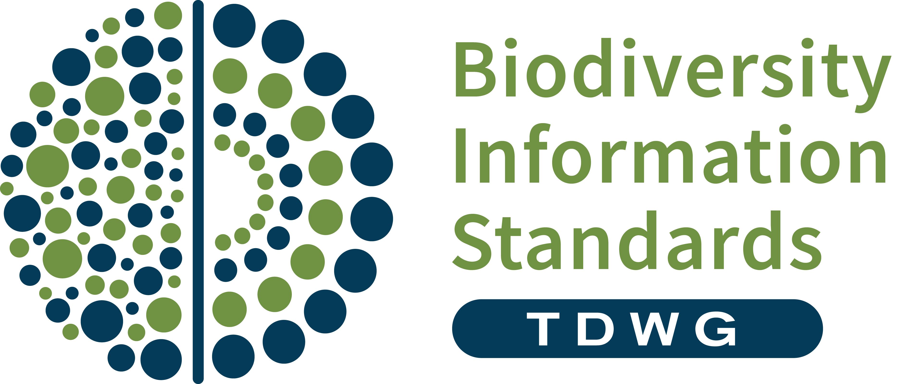

These slide decks are used in training delivered by OBIS. They're Markdown, built with [Quarto](https://quarto.org/) and reveal.js, and openly licensed ([CC BY‑NC 4.0](https://creativecommons.org/licenses/by-nc/4.0/)). Reuse them freely by [forking the repo](https://github.com/iobis/obis_edna_slides).

## Slide Decks by Topic

::: {.topic-boxes}
**Darwin Core**[{.topic-box-img}](index-dwc.qmd){.topic-box}

**DNA data**[🧬](index-dna.qmd){.topic-box .topic-box-emoji}
:::

## Trainings Delivered

Slide decks and resources compiled for individual training courses or workshops.

### 2026

- [July INVEMAR DNA data management](index-invemar.qmd)
- [July OBIS Node Training on DNA data](https://iobis.github.io/obis_edna_slides_node_training/)
- [September DOOS Accelerator: Mobilizing Deep Ocean Biodiversity Data](index-doos.qmd)
